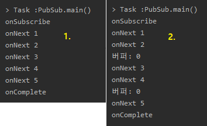
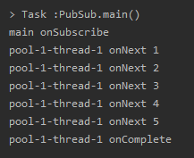
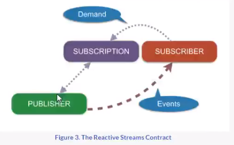
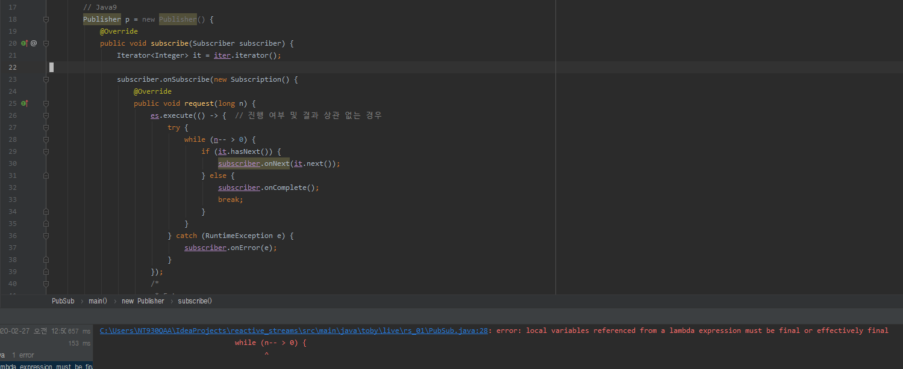

Reactive Streams
=====
* 다루는 내용
	* Duality
	* Observer Pattern(ex. Listener)
	* Reactive Streams - 표준 - Java9 API
* [강의 링크](https://www.youtube.com/watch?v=8fenTR3KOJo): 26/11/2016
* [HomoEfficio님 코드](https://github.com/HomoEfficio/toby-spring-tv)
- - -
## 목차
1. [Duality](#Duality)
	* [Iterable](#Iterable)
	* [Observable](#Observable)
2. [Observer Pattern](#Observer-Pattern)
3. [Reactive Streams](#Reactive-streams)
4. [참고](#참고)

## Duality
| Iterable | Observable |
| -- | -- |
| Pull | Push |

이 둘은 기능은 같지만 구조가 반대 방향이고, Observable에는 어떤 장점이 있는지 아래서 살펴보고자 한다.

### Iterable
* 컬렉션이 아니더라도 Iterable 인터페이스를 구현한 데이터를 가진 객체라면 for-each 구문 사용 가능  
	```java
	// 1. asList 메소드 리턴타입: List<T>
	List<Integer> list = Arrays.asList(1, 2, 3, 4, 5);

	// 2. List 타입은 Iterable 인터페이스의 Sub-type
	/*
	 * public interface List<E> extends Collection<E> { }
	 * public interface Collection<E> extends Iterable<E> { }
	 * public interface Iterable<T> {
	 * - Implementing this interface allows an object to be the target
	 *    of the "for-each loop" statement(since 1.5).
	 *  - 즉, 컬렉션이 아니더라도 이 인터페이스를 구현한 데이터를 가진
	 *    객체가 있다면 for-each 구문 사용 가능
	 * }
	 */
	Iterable<Integer> iter = Arrays.asList(1, 2, 3, 4, 5);
	for (Integer i : iter) {    // for-each
		System.out.println(i);
	}
	```
* 따라서 Collection이 아닌 Iterable을 커스터마이징해서 사용 가능  
	```java
	Iterable<Integer> iter1 = new Iterable<Integer>() {
		@Override
		public Iterator<Integer> iterator() {
			return null;
		}
	};

	// 인터페이스(Iterable)에 메소드(Iterator) 하나일 경우 람다 이용(since 8)
	Iterable<Integer> iter2 = () ->
			new Iterator<Integer>() {
				int i = 0;
				final static int MAX = 10;

				@Override
				public boolean hasNext() {
					return i < MAX;
				}

				@Override
				public Integer next() {
					return ++i;
				}
			};

	for (Integer i : iter2) {
		System.out.println(i);
	}

	// 자바5 이전 코드
	/*
	 * - for -> while 컴파일
	 * - 가져오면서 증가(∴ 증가문 필요 없음)
	 */
	for (Iterator<Integer> it = iter2.iterator(); it.hasNext(); ) {
		System.out.println(it.next());
	}
	```

##### [목차로 이동](#목차)

### Observable
* 하나의 스레드(main) 내에서 동작  
	```java
	@SuppressWarnings("deprecation")
	public class Ob {
		// Iterable <----> Observable(duality)
		// Pull            Push
		public static void main(String[] args) {
			Observer ob = new Observer() {
				@Override
				public void update(Observable o, Object arg) {
					System.out.println(arg);
				}
			};

			/*
			 * 이제부터 Observable이 던지는 모든 Event를 Observer가 받음
			 * Swing, Andriod 등 EventDriven에 해당하는 곳에선 이 패턴 사용
			 */
			IntObservable io = new IntObservable();
			io.addObserver(ob);

			io.run();
		}

		// Source(Event/Data) -> Observer
		// Data를 만들어내는 행위를 실행하는 메소드 -> Runnable로 비동기적 구현
		// since 1.0(∴ 람다 등 적용 없음)
		static class IntObservable extends Observable implements Runnable {
			@Override
			public void run() {
				for (int i = 1; i <= 10; i++) {
					setChanged();   // 변화 생겼음을 알림
					notifyObservers(i);
				}
			}
		}
	}
	```
* 이벤트를 별도의 스레드 할당해서 처리  
	```java
	@SuppressWarnings("deprecation")
	public class Ob {
		public static void main(String[] args) {
			Observer ob = new Observer() {
				@Override
				public void update(Observable o, Object arg) {
					System.out.println(Thread.currentThread().getName() + " " + arg);
				}
			};

			IntObservable io = new IntObservable();
			io.addObserver(ob);

			ExecutorService es = Executors.newSingleThreadExecutor();
			es.execute(io);

			System.out.println(Thread.currentThread().getName() + " EXIT");
			es.shutdown();
		}

		static class IntObservable extends Observable implements Runnable {
			@Override
			public void run() {
				for (int i = 1; i <= 10; i++) {
					setChanged();
					notifyObservers(i);
				}
			}
		}
	}
	```

실행 결과는 아래와 같다.

</br>

##### [목차로 이동](#목차)

## Observer Pattern
Reactive Extension을 처음 만든 MS 엔지니어들은 이러한 옵저버 패턴에 대해 두 가지 지적을 했다.

1. 완료 개념이 없다(ex. 주식 정보)
2. 비동기 구현 시 예외 처리에 대한 아이디어가 없다

* 한 개씩 받는 경우  
	```java
	package toby.live.rs_01;

	import java.util.Arrays;
	import java.util.Iterator;
	import java.util.concurrent.Flow.Publisher;
	import java.util.concurrent.Flow.Subscriber;
	import java.util.concurrent.Flow.Subscription;

	public class PubSub {
		public static void main(String[] args) {
			Iterable<Integer> iter = Arrays.asList(1, 2, 3, 4, 5);

			// Java9
			Publisher p = new Publisher() {
				@Override
				public void subscribe(Subscriber subscriber) {
					Iterator<Integer> it = iter.iterator();

					subscriber.onSubscribe(new Subscription() {
						@Override
						public void request(long n) {
							while (n-- > 0) {
								if (it.hasNext()) {
									subscriber.onNext(it.next());
								} else {
									subscriber.onComplete();
									break;
								}
							}
						}

						@Override
						public void cancel() {

						}
					});
				}
			};

			Subscriber<Integer> s = new Subscriber<Integer>() {
				Subscription subscription;

				@Override
				public void onSubscribe(Subscription subscription) {
					System.out.println("onSubscribe");
					this.subscription = subscription;
					this.subscription.request(1);
				}

				@Override
				public void onNext(Integer item) {
					System.out.println("onNext " + item);
					this.subscription.request(1);
				}

				@Override
				public void onError(Throwable throwable) {
					System.out.println("onError");
				}

				@Override
				public void onComplete() {
					System.out.println("onComplete");
				}
			};

			p.subscribe(s);
		}
	}
	```
* 두 개씩 받는 경우  
	```java
	// 이 외에는 위와 상동
	 Subscriber<Integer> s = new Subscriber<Integer>() {
		Subscription subscription;

		@Override
		public void onSubscribe(Subscription subscription) {
			System.out.println("onSubscribe");
			this.subscription = subscription;
			this.subscription.request(2);
		}

		int bufferSize = 2;

		@Override
		public void onNext(Integer item) {
			System.out.println("onNext " + item);
			if (--bufferSize <= 0) {
				System.out.println("버퍼: 0");
				bufferSize = 2;
				this.subscription.request(2);
			}
		}

		@Override
		public void onError(Throwable throwable) {
			System.out.println("onError");
		}

		@Override
		public void onComplete() {
			System.out.println("onComplete");
		}
	};
	```
	* 더 나은 옵저버 패턴인 Observable이 리액티브 프로그래밍의 한 축이라면 또 다른 축인 Scheduler가 비동기/병렬 처리에 좋기 때문에 이렇게 코드를 처리할 필요 없음
	* 복잡해보이지만 프레임워크의 기초이므로 이렇게 만든 클래스/메소드는 방대함

실행 결과는 아래와 같다.

</br>

추가적으로 비동기적으로 Event/Data를 보내는 경우를 생각해보자. Publisher가 Subscriber에게 Data를 보낼 때 스레드를 10개 생성해서 동시에 보내도 될까?(∵ Publisher의 작업 양이 많은 경우) Spec상으로는 불가능하다. Subscriber는 Sequential하게 데이터가 넘어올 것을 기대하고, 그것을 신경쓰지 않아도 된다(ex. forkJoin 불가능).

```java
package toby.live.rs_01;

import java.util.Arrays;
import java.util.Iterator;
import java.util.concurrent.ExecutorService;
import java.util.concurrent.Executors;
import java.util.concurrent.Flow.Publisher;
import java.util.concurrent.Flow.Subscriber;
import java.util.concurrent.Flow.Subscription;
import java.util.concurrent.Future;
import java.util.concurrent.TimeUnit;

public class PubSub {
    public static void main(String[] args) throws InterruptedException {
        Iterable<Integer> iter = Arrays.asList(1, 2, 3, 4, 5);
        ExecutorService es = Executors.newSingleThreadExecutor();

        // Java9
        Publisher p = new Publisher() {
            @Override
            public void subscribe(Subscriber subscriber) {
                Iterator<Integer> it = iter.iterator();

                subscriber.onSubscribe(new Subscription() {
                    @Override
                    public void request(long n) {
                        es.execute(() -> {  // 진행 여부 및 결과 상관 없는 경우
                            int i = 0;
                            try {
                                while (i++ < n) {
                                    if (it.hasNext()) {
                                        subscriber.onNext(it.next());
                                    } else {
                                        subscriber.onComplete();
                                        break;
                                    }
                                }
                            } catch (RuntimeException e) {
                                subscriber.onError(e);
                            }
                        });
                        /*
                         * Future
                         *  - 비동기 작업 결과/완료 여부 정보를 제공
                         *  - 이 경우 event이므로 타입은 없으니 와일드 카드 사용
                         *  - 중간에 cancel하는 경우 Future 통해 interrupt 가능
                         */
//                        Future<?> f = es.submit(() -> {   // 진행 상황 체크하고 싶은 경우
//                            try {
//                                while (n-- > 0) {
//                                    if (it.hasNext()) {
//                                        subscriber.onNext(it.next());
//                                    } else {
//                                        subscriber.onComplete();
//                                        break;
//                                    }
//                                }
//                            } catch (RuntimeException e) {
//                                subscriber.onError(e);
//                            }
//                        });
                    }

                    @Override
                    public void cancel() {

                    }
                });
            }
        };

        Subscriber<Integer> s = new Subscriber<Integer>() {
            Subscription subscription;

            @Override
            public void onSubscribe(Subscription subscription) {
                System.out.println(Thread.currentThread().getName() + " onSubscribe");
                this.subscription = subscription;
                this.subscription.request(1);
            }

            @Override
            public void onNext(Integer item) {
                System.out.println(Thread.currentThread().getName() + " onNext " + item);
                this.subscription.request(1);
            }

            @Override
            public void onError(Throwable throwable) {
                System.out.println("onError: " + throwable.getMessage());
            }

            @Override
            public void onComplete() {
                System.out.println(Thread.currentThread().getName() + " onComplete");
            }
        };

        p.subscribe(s);

        es.awaitTermination(10, TimeUnit.HOURS);
        es.shutdown();
    }
}
```

실행 결과는 아래와 같다.

</br>

- - -
* The Reactive Streams Contract  
	</br>
* 예외 처리  
	```java
	subscriber.onSubscribe(new Subscription() {
		@Override
		public void request(long n) {
			try {
				while (n-- > 0) {
					if (it.hasNext()) {
						subscriber.onNext(it.next());
					} else {
						subscriber.onComplete();
						break;
					}
				}
			} catch(RuntimeException e) {
				subscriber.onError(e);
			}
		}
	});
	```
* 자유 변수
	* 람다 표현식 외부에 있는 변수를 람다가 사용할 경우 해당 변수를 자유 변수라 부름  
		</br>
	* 람다식에서 자유 변수를 허용할 수 없는 이유는 스레드 한정을 위반하기 때문

##### [목차로 이동](#목차)

## Reactive Streams
* [ReactiveX](http://reactivex.io/)
* [Reactive Streams](http://www.reactive-streams.org/)

스프링이 구현하고 있는 Reactive Web이라는 기술이 Reactive Streams(표준)에 바탕을 두고 있다. 다음에는 이를 바탕으로 스프링 5.0의 엔진으로 사용되고 있는 Reactor와 RxJava, 두 가지 구현을 살펴본다. 사실 이런 류의 것들은 워낙 미리 만들어진 것들이 많아서 쉽게 쓸 수 있고, 위의 코드 같은 것도 몰라도 된다(∵ 비즈니스 로직 코드와 스레드 등의 코드가 혼합).

##### [목차로 이동](#목차)

## 참고
* [RxJava를 활용한 리액티브 프로그래밍](https://blog.insightbook.co.kr/2017/04/20/rxjava%EB%A5%BC-%ED%99%9C%EC%9A%A9%ED%95%9C-%EB%A6%AC%EC%95%A1%ED%8B%B0%EB%B8%8C-%ED%94%84%EB%A1%9C%EA%B7%B8%EB%9E%98%EB%B0%8D-rxjava%EC%9D%98-%EA%B0%9C%EB%85%90%EA%B3%BC-%EC%82%AC%EC%9A%A9%EB%B2%95/)
* [웹 프론트엔드 개발자의 얕고 넓은 Rx 이야기](https://www.slideshare.net/jeokrang/rx-70197043)
* [병렬 데이터 처리와 성능](https://black9p.github.io/2018/01/20/%EB%B3%91%EB%A0%AC-%EB%8D%B0%EC%9D%B4%ED%84%B0-%EC%B2%98%EB%A6%AC%EC%99%80-%EC%84%B1%EB%8A%A5/)
* [쓰레드풀과 ForkJoinPool](https://okky.kr/article/345720)
* 기타 언급: akka, grpc

##### [목차로 이동](#목차)
