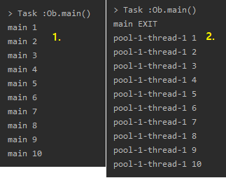

Reactive Streams
=====
* 다루는 내용
	* Duality
	* Observer Pattern(ex. Listener)
	* Reactive Streams - 표준 - Java9 API
* [강의 링크](https://www.youtube.com/watch?v=8fenTR3KOJo): 26/11/2016
* [HomoEfficio님 코드](https://github.com/HomoEfficio/toby-spring-tv)
- - -
## 목차
1. [Duality](#Duality)
	* [Iterable](#Iterable)
	* [Observable](#Observable)
2. [Observer Pattern](#Observer-Pattern)
3. .
4. [참고](#참고)

## Duality
| Iterable | Observable |
| -- | -- |
| Pull | Push |

이 둘은 기능은 같지만 구조가 반대 방향이고, Observable에는 어떤 장점이 있는지 아래서 살펴보고자 한다.

### Iterable
* 컬렉션이 아니더라도 Iterable 인터페이스를 구현한 데이터를 가진 객체라면 for-each 구문 사용 가능  
	```java
	// 1. asList 메소드 리턴타입: List<T>
	List<Integer> list = Arrays.asList(1, 2, 3, 4, 5);

	// 2. List 타입은 Iterable 인터페이스의 Sub-type
	/*
	 * public interface List<E> extends Collection<E> { }
	 * public interface Collection<E> extends Iterable<E> { }
	 * public interface Iterable<T> {
	 * - Implementing this interface allows an object to be the target
	 *    of the "for-each loop" statement(since 1.5).
	 *  - 즉, 컬렉션이 아니더라도 이 인터페이스를 구현한 데이터를 가진
	 *    객체가 있다면 for-each 구문 사용 가능
	 * }
	 */
	Iterable<Integer> iter = Arrays.asList(1, 2, 3, 4, 5);
	for (Integer i : iter) {    // for-each
		System.out.println(i);
	}
	```
* 따라서 Collection이 아닌 Iterable을 커스터마이징해서 사용 가능  
	```java
	Iterable<Integer> iter1 = new Iterable<Integer>() {
		@Override
		public Iterator<Integer> iterator() {
			return null;
		}
	};

	// 인터페이스(Iterable)에 메소드(Iterator) 하나일 경우 람다 이용(since 8)
	Iterable<Integer> iter2 = () ->
			new Iterator<Integer>() {
				int i = 0;
				final static int MAX = 10;

				@Override
				public boolean hasNext() {
					return i < MAX;
				}

				@Override
				public Integer next() {
					return ++i;
				}
			};

	for (Integer i : iter2) {
		System.out.println(i);
	}

	// 자바5 이전 코드
	/*
	 * - for -> while 컴파일
	 * - 가져오면서 증가(∴ 증가문 필요 없음)
	 */
	for (Iterator<Integer> it = iter2.iterator(); it.hasNext(); ) {
		System.out.println(it.next());
	}
	```

##### [목차로 이동](#목차)

### Observable
* 하나의 스레드(main) 내에서 동작  
	```java
	@SuppressWarnings("deprecation")
	public class Ob {
		// Iterable <----> Observable(duality)
		// Pull            Push
		public static void main(String[] args) {
			Observer ob = new Observer() {
				@Override
				public void update(Observable o, Object arg) {
					System.out.println(arg);
				}
			};

			/*
			 * 이제부터 Observable이 던지는 모든 Event를 Observer가 받음
			 * Swing, Andriod 등 EventDriven에 해당하는 곳에선 이 패턴 사용
			 */
			IntObservable io = new IntObservable();
			io.addObserver(ob);

			io.run();
		}

		// Source(Event/Data) -> Observer
		// Data를 만들어내는 행위를 실행하는 메소드 -> Runnable로 비동기적 구현
		// since 1.0(∴ 람다 등 적용 없음)
		static class IntObservable extends Observable implements Runnable {
			@Override
			public void run() {
				for (int i = 1; i <= 10; i++) {
					setChanged();   // 변화 생겼음을 알림
					notifyObservers(i);
				}
			}
		}
	}
	```
* 이벤트를 별도의 스레드 할당해서 처리  
	```java
	@SuppressWarnings("deprecation")
	public class Ob {
		public static void main(String[] args) {
			Observer ob = new Observer() {
				@Override
				public void update(Observable o, Object arg) {
					System.out.println(Thread.currentThread().getName() + " " + arg);
				}
			};

			IntObservable io = new IntObservable();
			io.addObserver(ob);

			ExecutorService es = Executors.newSingleThreadExecutor();
			es.execute(io);

			System.out.println(Thread.currentThread().getName() + " EXIT");
			es.shutdown();
		}

		static class IntObservable extends Observable implements Runnable {
			@Override
			public void run() {
				for (int i = 1; i <= 10; i++) {
					setChanged();
					notifyObservers(i);
				}
			}
		}
	}
	```

참고로 실행 결과는 아래와 같다.

</br>

##### [목차로 이동](#목차)

## Observer Pattern
Reactive Extension을 처음 만든 MS 엔지니어들은 이러한 옵저버 패턴에 대해 두 가지 지적을 했다.

1. 완료 개념이 없다(ex. 주식 정보)
2. 비동기 구현 시 예외 처리에 대한 아이디어가 없다

55:00

##### [목차로 이동](#목차)

## 참고
* [RxJava를 활용한 리액티브 프로그래밍](https://blog.insightbook.co.kr/2017/04/20/rxjava%EB%A5%BC-%ED%99%9C%EC%9A%A9%ED%95%9C-%EB%A6%AC%EC%95%A1%ED%8B%B0%EB%B8%8C-%ED%94%84%EB%A1%9C%EA%B7%B8%EB%9E%98%EB%B0%8D-rxjava%EC%9D%98-%EA%B0%9C%EB%85%90%EA%B3%BC-%EC%82%AC%EC%9A%A9%EB%B2%95/)
* [웹 프론트엔드 개발자의 얕고 넓은 Rx 이야기](https://www.slideshare.net/jeokrang/rx-70197043)

##### [목차로 이동](#목차)
