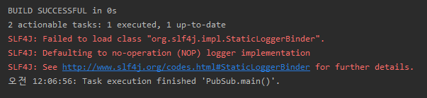
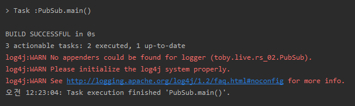
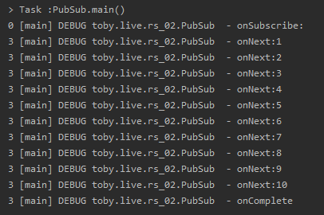

스프링 리액티브 웹 개발 - Operator
=====
* 다루는 내용
	* Operator
	* Reactor
* [강의 링크](https://www.youtube.com/watch?v=DChIxy9g19o): 03/12/2016
- - -
## 목차
1. [복습](#복습)
2. [Operator](#Operator)
3. [Reactor](#Reactor)
4. [참고](#참고)

## 복습
```java
package toby.live.rs_02;

import lombok.extern.slf4j.Slf4j;
import org.apache.log4j.BasicConfigurator;
import org.reactivestreams.Publisher;
import org.reactivestreams.Subscriber;
import org.reactivestreams.Subscription;

import java.util.stream.Collectors;
import java.util.stream.Stream;

@Slf4j
public class PubSub {
    public static void main(String[] args) {
        BasicConfigurator.configure();

        // 지난 주(JAVA9)와 다른 Publisher API 사용(∴ JAVA8에서도 사용 가능)
        Publisher<Integer> pub = new Publisher<Integer>() {
            // Publisher의 Data Source
            Iterable<Integer> iter = Stream.iterate(1, a -> a + 1)
                    .limit(10)
                    .collect(Collectors.toList());

            @Override
            public void subscribe(Subscriber<? super Integer> sub) {
                // Spec에 따르면 subscribe을 호출하면 DATA를 보내야 하는데,
                // protocol에 따르면 가장 먼저 subscriber의 onSubscribe 호출
                sub.onSubscribe(new Subscription() {
                    @Override
                    public void request(long n) {
                        try {
                            iter.forEach(s -> sub.onNext(s));
                            sub.onComplete();   // Reactive에서 빠드리면 안되는 것!
                        } catch (Throwable t) {
                            sub.onError(t);
                        }
                    }

                    @Override
                    public void cancel() {

                    }
                });
            }
        };

        Subscriber<Integer> sub = new Subscriber<Integer>() {
            @Override
            public void onSubscribe(Subscription s) {
                log.debug("onSubscribe:");
                s.request(Long.MAX_VALUE);  // 무제한 데이터 받기
            }

            @Override
            public void onNext(Integer i) {
                log.debug("onNext:{}", i);
            }

            @Override
            public void onError(Throwable t) {
                log.debug("onError:{}", t);
            }

            @Override
            public void onComplete() {
                log.debug("onComplete");
            }
        };

        pub.subscribe(sub);
    }
}
```

* JAVA9이 아닌 다른 API(org.reactivestreams) 사용(∴ JAVA8에서도 사용 가능)
* @Slf4j 사용 위에 Lombok 의존성(compile/annotationProcessor) 및 플러그인 추가
	* 에러1 → slf4j 및 logback 의존성 추가(build.gradle)  
		</br>
	* 에러2 → `BasicConfigurator.configure();` 추가  
		</br>

실행 결과는 아래와 같다.

</br>

하단은 위 코드의 리팩토링이다.

```java
@Slf4j
public class PubSub {
    public static void main(String[] args) {
        BasicConfigurator.configure();

        // 지난 주(JAVA9)와 다른 Publisher API 사용(∴ JAVA8에서도 사용 가능)
        Publisher<Integer> pub = iterPub(Stream.iterate(1, a -> a + 1)
                .limit(10)
                .collect(Collectors.toList()));

        pub.subscribe(logSub());
    }

    private static Subscriber<Integer> logSub() {
        return new Subscriber<Integer>() {
            @Override
            public void onSubscribe(Subscription s) {
                log.debug("onSubscribe:");
                s.request(Long.MAX_VALUE);  // 무제한 데이터 받기
            }

            @Override
            public void onNext(Integer i) {
                log.debug("onNext:{}", i);
            }

            @Override
            public void onError(Throwable t) {
                log.debug("onError:{}", t);
            }

            @Override
            public void onComplete() {
                log.debug("onComplete");
            }
        };
    }

    private static Publisher<Integer> iterPub(List<Integer> iter) {
        return new Publisher<Integer>() {
            @Override
            public void subscribe(Subscriber<? super Integer> sub) {
                // Spec에 따르면 subscribe을 호출하면 DATA를 보내야 하는데,
                // protocol에 따르면 가장 먼저 subscriber의 onSubscribe 호출
                sub.onSubscribe(new Subscription() {
                    @Override
                    public void request(long n) {
                        try {
                            iter.forEach(s -> sub.onNext(s));
                            sub.onComplete();   // Reactive에서 빠드리면 안되는 것!
                        } catch (Throwable t) {
                            sub.onError(t);
                        }
                    }

                    @Override
                    public void cancel() {

                    }
                });
            }
        };
    }
}
```

- - -
* [Reactive Streams 의존성 추가](https://mvnrepository.com/artifact/org.reactivestreams/reactive-streams/1.0.0)
* [IntelliJ에서 자바 라이브러리(jar) 추가하는 방법](https://codechacha.com/ko/how-to-add-jar-in-intellij/)
* [No appenders could be found for logger(log4j)?](https://stackoverflow.com/questions/12532339/no-appenders-could-be-found-for-loggerlog4j)
	* [log4j2 프로젝트에 log4j 라이브러리 사용시 충돌](https://multifrontgarden.tistory.com/217)

##### [목차로 이동](#목차)

## Operator
```txt
Pub → [Data1] → mapPub → [Data2] → logSub
				← subscribe(logSub)
				→ onSubscribe(s)
				→ onNext
				→ onNext
				→ onComplete
1. map(d1 → f → d2)
```

32:40

##### [목차로 이동](#목차)

## Reactor


##### [목차로 이동](#목차)

## 참고
* Slf4j
	* [Slf4j를 사용해야 하는 이유](https://inyl.github.io/programming/2017/05/05/slf4j.html)
	* [Slf4j를 이용한 Logging](https://gmlwjd9405.github.io/2019/01/04/logging-with-slf4j.html)
	* [Slf4j Tutorials for Beginners](https://examples.javacodegeeks.com/enterprise-java/slf4j/slf4j-tutorial-beginners/)
	* [Slf4j 로깅 처리](https://sonegy.wordpress.com/2014/05/23/how-to-slf4j/)
* [Gradle을 이용한 java sample project 개발](https://netframework.tistory.com/entry/Gradle-%EC%A0%95%EB%A6%AC-single-project)

##### [목차로 이동](#목차)