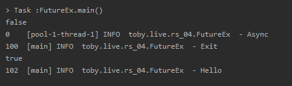
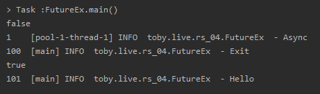

스프링 리액티브 웹 개발 - 자바와 스프링의 비동기 기술
=====
* 다루는 내용
	* Future
	* .
* [강의 링크](https://www.youtube.com/watch?v=aSTuQiPB4Ns): 17/12/2016
- - -
## 목차
1. [Future](#Future)
2. [Callback](#Callback)
3. .
4. [참고](#참고)

## Future
> A Future represents the result of an asynchronous computation.

Future[1]란 비동기적인 작업을 수행하고 난 결과를 나타내는 것이다. 비동기 작업의 수행을 단순하게 설명하면 새로운 스레드에게 작업을 시킨다는 것인데, 이후 그 스레드에서 작업을 수행한 결과를 가져오는 가장 기본이 되는 인터페이스가 Future라고 할 수 있다. 아래 코드로 설명해본다.

```java
/*
 * 실행 결과
 * 2초 후 → Hello → Exit
 */
// 스레드 풀 이용 스레드 직접 생성, 관리, 폐기 등 비용 줄임
// 여기서 비용이란 CPU, 메모리 잡아먹는 걸 의미
ExecutorService es = Executors.newCachedThreadPool();
Thread.sleep(2000);
System.out.println("Hello");

System.out.println("Exit");
```

원하는 것은 `Hello`를 출력하는 작업과 `Exit`를 출력하는 작업을 별도의 스레드에서 실행하는 것이다. 이를 확인하기 위해 로거[2]를 이용해 출력한다(∵ 로거들이 출력할 때 기본 포맷에는 대부분 수행하는 스레드명이 함께 출력된다).

```java
/*
 * 실행 결과
 * Exit → 2초 후 → Async
 */
ExecutorService es = Executors.newCachedThreadPool();
es.execute(() -> {
	try {
		Thread.sleep(2000);
	} catch (InterruptedException e) { }
	log.info("Async");
});

log.info("Exit");
```

실제 실행 결과는 아래와 같이 나온다.

</br>

이번엔 코드를 조금 바꿔서 출력이 아니라 리턴이 되도록 만들어보자.

```java
/*
 * 실행 결과
 * 2초 후 → Async → Hello → Exit 
 */
ExecutorService es = Executors.newCachedThreadPool();
Future<String> f = es.submit(() -> {
	Thread.sleep(2000);
	log.info("Async");
	return "Hello";
});

log.info(f.get());
log.info("Exit");
```

여기서 핵심은 `f.get()`이다. 이 문장은 2초 이전에 실행이 되게 되는데 Future의 값을 사용하기 때문에 결과가 리턴, 즉 비동기 작업이 완료될 때까지 Blocking[4]된 상태가 된다. 따라서 다음 Statement로 내려갈 수 없게 되므로 Exit이 맨 마지막에 찍히게 된다(∵ 동일 스레드). 만약 `f.get()`이 없다면 Exit이 먼저 찍히게 된다.

한편 위 코드의 `submit` 메소드는 `execute` 메소드와 마찬가지로 Runnable도 인자로 받지만 Result 값을 함께 세팅해줄 수 있고, 이외에도 Callable 인터페이스[3]를 받을 수 있다. 실행 결과는 아래와 같다.

</br>

이때 드는 의문은 Future를 이용해 대기(`f.get()`)할거면 굳이 별도의 스레드를 만들어서 처리할 이유가 있나 하는 점이다. 하나의 스레드(main)에서 쭉 이어서 처리하면 되는 거 아닌가 할 수 있지만, 꼭 그렇지만은 않다. Producer-Consumer 패턴을 이용해서 블로킹 기술을 사용하는 등 여러가지 응용 방법이 있기 때문에 블로킹 메소드도 비동기적 시스템을 구현할 때 유용하게 쓰는 케이스들이 있다. 아래와 같은 시나리오도 있다.

```java
ExecutorService es = Executors.newCachedThreadPool();
Future<String> f = es.submit(() -> {
	Thread.sleep(2000);
	log.info("Async");
	return "Hello";
});

System.out.println(f.isDone());
Thread.sleep(2100);
log.info("Exit");
System.out.println(f.isDone());
log.info(f.get());
```

`f.isDone()`은 작업완료 여부를 알 수 있는 메소드로 즉시 리턴된다. 다시 말해 `f.get()`처럼 블로킹하지 않고 작업 결과를 확인했으면 즉시 리턴한다. 따라서 `f.isDone()`의 조건에 따라 루프를 돌면서 작업을 처리하는 구조를 만들 수 있다. 위 코드의 실행 결과는 아래와 같다.

</br>

정리하면 Future라는 것은 비동기 작업의 리턴값 그 자체는 아니다. 그보단 리턴값을 얻어올 방법을 제공해주는 일종의 핸들러에 가깝다고 할 수 있다.

- - -
* [1]
	* 비슷한 기술로 Callback, Promise, DeferredResult 등이 있다.
	* [Spring Web 비동기](http://wonwoo.ml/index.php/post/1912)
* [2]  
	</br>
	* [설정 방법](https://stackoverflow.com/questions/12532339/no-appenders-could-be-found-for-loggerlog4j)을 좀 헤매서 확인하고 공부 필요
* [3]
	* Callable 인터페이스와 Runnable 인터페이스는 자바의 가장 기본이 되는 인터페이스이므로 꼭 기억할 필요
	* Callable은 Runnable과 다르게 값을 리턴할 수 있고, Exception도 던지는 것으로 메소드가 정의되어 있음(∴ Runnable처럼 예외를 직접 안에서 잡아줄 필요 없음)
* [4]
	* 내가 어떤 작업의 특정 결과를 가져올 때까지 메서드 호출 리턴이 대기 상태에 있다면 Blocking
	* 만약 아직 들어온 데이터(주로 IO에서 언급)가 없는데도 바로 리턴이 된다면 Non-Blocking

##### [목차로 이동](#목차)

## Callback
Future와 비슷한 방식인 콜백 역시 비동기 작업을 수행하고 그 결과를 받아올 때 많이 사용하는 방식 중 하나이다. 실제로 자바8이 나오기 이전 많이 사용되었다. 콜백이란 특정 조건에 맞으면 이 작업을 수행해주세요, 즉 작업을 던진 것으로 일종의 커맨드 패턴 혹은 전략 패턴을 아우르는 것으로 볼 수 있다. 쉽게 말해 오브젝트 안의 메소드를 실행해달라고 오브젝트를 던지는 것이다.

```java
ExecutorService es = Executors.newCachedThreadPool();
FutureTask<String> f = new FutureTask<>(() -> {
	Thread.sleep(2000);
	log.info("Async");
	return "Hello";
});

es.execute(f);

System.out.println(f.isDone());
Thread.sleep(2100);
log.info("Exit");
System.out.println(f.isDone());
log.info(f.get());
```

이는 Future의 마지막 코드와 동일한 작업을 자바의 기본적인 Future를 기반으로 한 Concurrency 라이브러리를 이용해서 콜백 방식으로 만든 코드이다. 코드에 대해 설명하자면 기존의 Future는 스레드풀의 `submit()`을 이용해 어떤 작업을 던지고 결과를 받아왔다. 여기에선 Future 자체를 오브젝트로 만들 수 있는 FutureTask를 이용했다. FutureTask는 Future 인터페이스의 구현 클래스로 Future 오브젝트와 비동기로 수행할 작업인 콜백 메소드가 하나의 오브젝트에 들어가 있게 된다.

실행 결과는 기존과 동일함을 확인할 수 있다.

</br>

31:00

```java
ExecutorService es = Executors.newCachedThreadPool();
FutureTask<String> f = new FutureTask<String>(() -> {
	Thread.sleep(2000);
	log.info("Async");
	return "Hello";
}) {
	@Override
	protected void done() {
		try {
			System.out.println(get());
		} catch (InterruptedException e) {
			e.printStackTrace();
		} catch (ExecutionException e) {
			e.printStackTrace();
		}
	}
};

es.execute(f);
es.shutdown();
```

##### [목차로 이동](#목차)

## 참고
* [CompletableFuture in Java 8, asynnchronous processing done right - Tomasz Nurkiewicz](https://www.youtube.com/watch?v=-MBPQ7NIL_Y)
* [Concurrency in Java 8: Parallel Streams, CompletableFuture, and All That](https://www.youtube.com/watch?v=x5akmCWgGY0)
* [함수형 자바스크립트와 동시성 프로그래밍](https://www.youtube.com/watch?v=4sO0aWTd3yc)

##### [목차로 이동](#목차)
