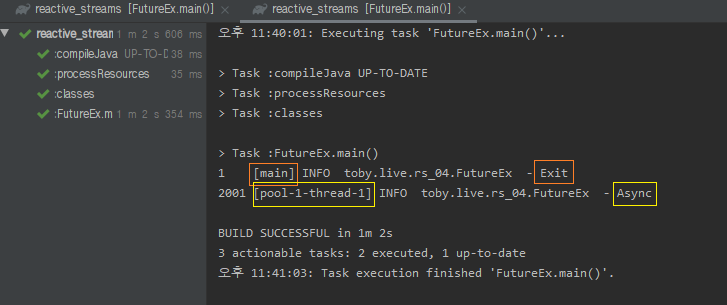
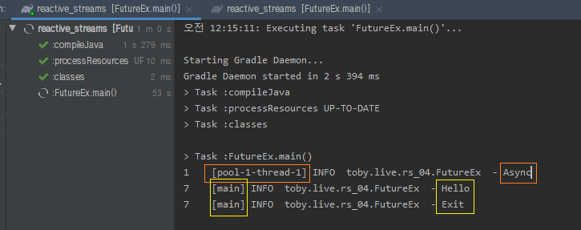
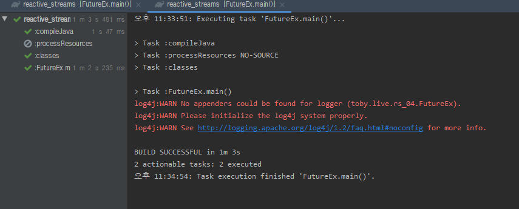

스프링 리액티브 웹 개발 - 자바와 스프링의 비동기 기술
=====
* 다루는 내용
	* Future
	* .
* [강의 링크](https://www.youtube.com/watch?v=aSTuQiPB4Ns): 17/12/2016
- - -
## 목차
1. [Future](#Future)
2. .
3. .
4. [참고](#참고)

## Future
> A Future represents the result of an asynchronous computation.

Future[1]란 비동기적인 작업을 수행하고 난 결과를 나타내는 것이다. 비동기 작업의 수행을 단순하게 설명하면 새로운 스레드에게 작업을 시킨다는 것인데, 이후 그 스레드에서 작업을 수행한 결과를 가져오는 가장 기본이 되는 인터페이스가 Future라고 할 수 있다. 아래 코드로 설명해본다.

```java
/*
 * 실행 결과
 * 2초 후 → Hello → Exit
 */
// 스레드 풀 이용 스레드 직접 생성, 관리, 폐기 등 비용 줄임
// 여기서 비용이란 CPU, 메모리 잡아먹는 걸 의미
ExecutorService es = Executors.newCachedThreadPool();
Thread.sleep(2000);
System.out.println("Hello");

System.out.println("Exit");
```

원하는 것은 `Hello`를 출력하는 작업과 `Exit`를 출력하는 작업을 별도의 스레드에서 실행하는 것이다. 이를 확인하기 위해 로거[2]를 이용해 출력한다(∵ 로거들이 출력할 때 기본 포맷에는 대부분 수행하는 스레드명이 함께 출력된다).

```java
/*
 * 실행 결과
 * Exit → 2초 후 → Async
 */
ExecutorService es = Executors.newCachedThreadPool();
es.execute(() -> {
	try {
		Thread.sleep(2000);
	} catch (InterruptedException e) { }
	log.info("Async");
});

log.info("Exit");
```

실제 실행 결과는 아래와 같이 나온다.

</br>

이번엔 코드를 조금 바꿔서 출력이 아니라 리턴이 되도록 만들어보자.

```java
/*
 * 실행 결과
 * 2초 후 → Async → Hello → Exit 
 */
ExecutorService es = Executors.newCachedThreadPool();
Future<String> f = es.submit(() -> {
	Thread.sleep(2000);
	log.info("Async");
	return "Hello";
});

log.info(f.get());
log.info("Exit");
```

여기서 핵심은 `f.get()`이다. 이 문장은 2초 이전에 실행이 되게 되는데 Future의 값을 사용하기 때문에 결과가 리턴, 즉 비동기 작업이 완료될 때까지 Blocking된 상태가 된다. 따라서 다음 Statement로 내려갈 수 없게 되므로 Exit이 맨 마지막에 찍히게 된다(∵ 동일 스레드). 만약 `f.get()`이 없다면 Exit이 먼저 찍히게 된다.

한편 위 코드의 `submit` 메소드는 `execute` 메소드와 마찬가지로 Runnable도 인자로 받지만 Result 값을 함께 세팅해줄 수 있고, 이외에도 Callable 인터페이스[3]를 받을 수 있다. 실행 결과는 아래와 같다.

</br>

20:45

- - -
* [1]
	* 비슷한 기술로 Promise, DeferredResult 등이 있다.
	* [Spring Web 비동기](http://wonwoo.ml/index.php/post/1912)
* [2]  
	</br>
	* [설정 방법](https://stackoverflow.com/questions/12532339/no-appenders-could-be-found-for-loggerlog4j)을 좀 헤매서 확인하고 공부 필요
* [3]
	* Callable 인터페이스와 Runnable 인터페이스는 자바의 가장 기본이 되는 인터페이스이므로 꼭 기억할 필요
	* Callable은 Runnable과 다르게 값을 리턴할 수 있고, Exception도 던지는 것으로 메소드가 정의되어 있음(∴ Runnable처럼 예외를 직접 안에서 잡아줄 필요 없음)
* [4]
	* .

##### [목차로 이동](#목차)

## 참고
* [CompletableFuture in Java 8, asynnchronous processing done right - Tomasz Nurkiewicz](https://www.youtube.com/watch?v=-MBPQ7NIL_Y)
* [Concurrency in Java 8: Parallel Streams, CompletableFuture, and All That](https://www.youtube.com/watch?v=x5akmCWgGY0)
* [함수형 자바스크립트와 동시성 프로그래밍](https://www.youtube.com/watch?v=4sO0aWTd3yc)

##### [목차로 이동](#목차)
